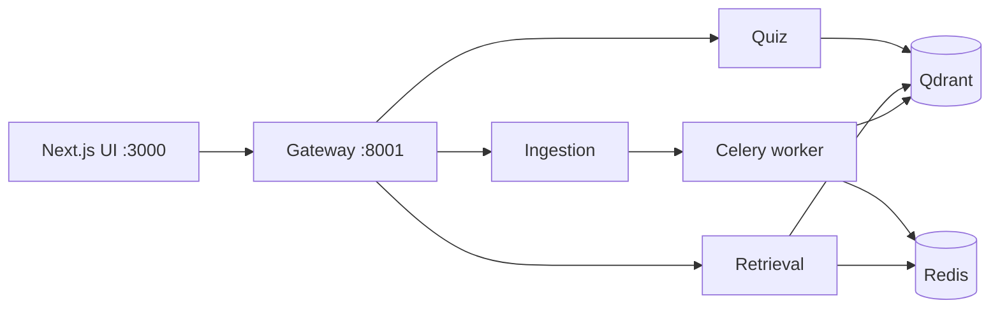

# Sourcerer

AI-powered RAG platform for educational content — a microservice backend behind an API gateway, with a Next.js frontend.

- **Streaming chat** over your course material — hybrid search (dense + BM25), cross-encoder reranking, session memory, and inline `[n]` citations streamed token-by-token over SSE
- **Quiz generation** — MCQs built from retrieved course content (T5 + spaCy/NLTK), with course/year/tag filters
- **Google Drive ingestion** — parse → chunk → tag → embed → index, run asynchronously on Celery workers into Qdrant

## Architecture



The gateway is a streaming reverse proxy (httpx) that routes `/api/v1/*` to the owning service, passes SSE through unbuffered, and aggregates every service's health at `GET /health`. Services share `libs/sourcerer-core` (config, embeddings, vector store, structured retrieval) via a uv workspace.

| Route prefix | Service | Highlights |
|---|---|---|
| `/api/v1/chat`, `/api/v1/retrieve` | retrieval | LangGraph agent, `POST /chat/stream` (SSE), Redis chat memory, query condensation |
| `/api/v1/quiz` | quiz | MCQ generation from hybrid-search results, filters applied |
| `/api/v1/ingest` | ingestion | Google Drive intake, Docling parsing, incremental sync |

## Quickstart

```bash
git clone https://github.com/EWhizardTech/sourcerer.git
cd sourcerer

cp .env.schema .env            # fill in Qdrant / Groq / Gemini keys
docker compose up -d --build

# UI       → http://localhost:3000
# Gateway  → http://localhost:8001/health
```

## Layout

```
frontend/              Next.js app (App Router, Tailwind v4, streaming chat UI)
services/
  gateway/             API gateway — proxy, SSE passthrough, health aggregation
  ingestion/           Drive intake + processing pipeline + Celery worker
  retrieval/           Agentic RAG chat (LangGraph, SSE streaming, Redis memory)
  quiz/                MCQ generation (T5, spaCy, NLTK)
libs/sourcerer-core/   Shared config, embeddings, vector store, retrieval
docs/                  MkDocs documentation
```

## Tech stack

Python 3.13 · FastAPI · LangGraph + Groq (chat agent) · Gemini embeddings · Qdrant (hybrid dense + BM25, RRF fusion) · fastembed cross-encoder rerank · Celery + Redis · Next.js 15 / React 19 / Tailwind v4 · uv workspaces · Docker Compose

## Development

```bash
uv sync --all-packages                     # Python workspace (single lockfile)
cd frontend && npm install && npm run dev  # UI on :3001 (host dev server)
```

Run tests per package:

```bash
cd services/retrieval && uv run python -m pytest tests -q
```

See `docs/development.md` for running services individually, environment details, and testing notes.

## Documentation

Full docs (architecture, RAG pipeline, per-service reference, deployment, development):

```bash
uv run mkdocs serve            # http://localhost:8000
```
