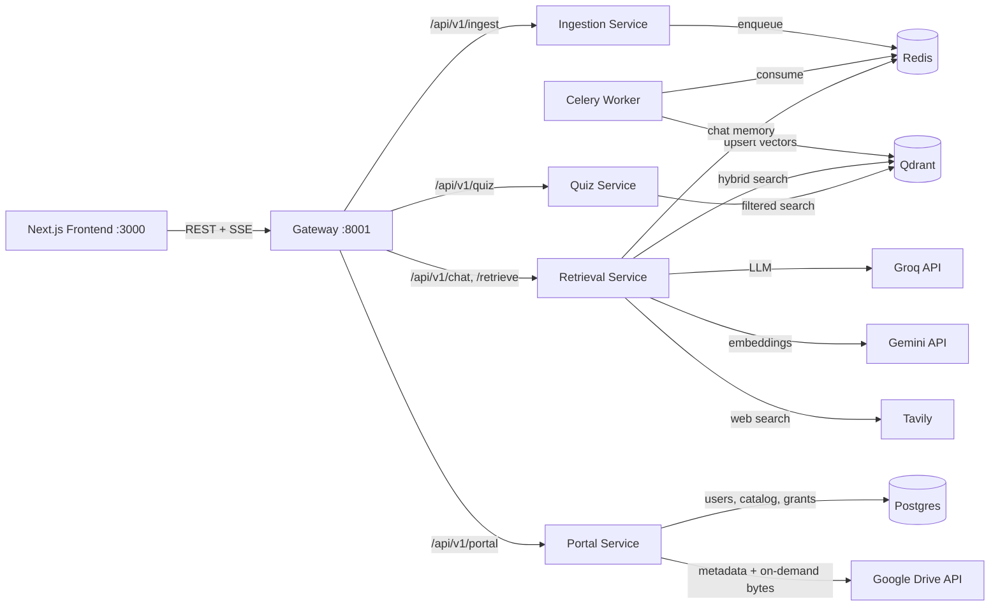

# Architecture

Sourcerer is a microservice system: five backend services behind an API gateway, a decoupled Next.js frontend, Redis for queueing and chat memory, Postgres for the resource portal, and a managed Qdrant cluster for vector search.

## Service responsibilities

| Service | Port (internal) | Responsibility |
|---|---|---|
| **gateway** | 8000 (published 8001) | Single public entry point. Streams every `/api/v1/*` request to the owning service, aggregates `/health`, handles CORS. |
| **ingestion** | 8000 | Lists and downloads Drive files, extracts folder metadata, dispatches one Celery task per file. |
| **ingestion-worker** | — | Runs the 8-stage pipeline: incremental check → parse (Docling/PyMuPDF) → chunk → LLM tag → embed (Gemini) → upsert (Qdrant) → track. |
| **retrieval** | 8000 | LangGraph agent with `search_documents` / `search_web` tools; SSE streaming; Redis session memory; query condensation; cited answers. |
| **quiz** | 8000 | Retrieves filtered chunks via `sourcerer-core` and generates MCQs with a local T5 + spaCy/NLTK pipeline. |
| **portal** | 8000 | Google sign-in, metadata-only Drive catalog, timed access requests/grants, access-checked in-app content viewing (Range streaming + PDF conversion). No ingestion, no vector store. See [Portal Service](services/portal.md). |

## Shared library — `sourcerer-core`

All Python services depend on `libs/sourcerer-core` (a [uv workspace](https://docs.astral.sh/uv/concepts/workspaces/) member):

- `config.py` — one typed `Settings` object for every service (each reads its subset)
- `embedding/` — Gemini embedding client (multimodal chunk + query embedding)
- `vector_store/` — Qdrant hybrid search (dense + BM25 sparse, RRF fusion) with integrated cross-encoder reranking
- `rerank.py` — fastembed ONNX cross-encoder (no torch dependency)
- `retrieval_service.py` — structured, filterable chunk retrieval (used by quiz)

## Design decisions

- **Services keep an internal `app/` package** and run with their own working directory — conventional per-service FastAPI layout with minimal import churn.
- **One lockfile** (`uv.lock`) governs the whole workspace; each Docker image installs only its own package's dependencies (`uv sync --package …`), so the gateway image stays tiny while quiz/ingestion carry their ML stacks. Images build in a uv builder stage and run on plain `python:3.13-slim`; the Celery worker reuses the ingestion image.
- **Torch is CPU-only inside containers** (per-service `[tool.uv.sources]`); local Windows dev resolves CUDA cu128 wheels.
- **The gateway is a dumb pipe**: no business logic, only routing, streaming passthrough, CORS, and health aggregation.
