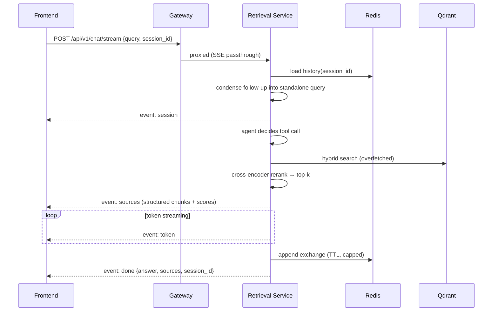

# RAG Pipeline

The retrieval pipeline is agentic: a LangGraph agent decides how to search, retrieval is hybrid and reranked, and answers stream back with structured citations.

## Query flow

## Stages

### 1. Conversation memory
History is stored in Redis per `session_id` (24 h TTL, last 20 messages). Follow-up questions are **condensed** into standalone queries by a fast Groq model before the agent runs, so "what about its complexity?" retrieves properly.

### 2. Agentic tool choice
The agent (model from `GROQ_MODEL`) must call a tool before answering:

- `search_documents` — always, by default
- `search_web` (Tavily) — only on an explicit user signal ("search the web", "check online", …), enforced both in the prompt and by restricting the tool binding

### 3. Hybrid search + reranking
`vector_store_service.search()`:

1. Dense prefetch — Gemini query embedding (2048-dim, cosine)
2. Sparse prefetch — BM25 (`Qdrant/bm25`)
3. RRF fusion, **overfetching `k × RERANK_OVERFETCH` candidates**
4. Cross-encoder rerank (`Xenova/ms-marco-MiniLM-L-6-v2`, ONNX via fastembed) → top `k`

Every hit carries its RRF `score`, `rerank_score`, and `point_id`. Reranking is toggled by `RERANK_ENABLED` and degrades gracefully to RRF order if the model can't load.

### 4. Structured citations
`search_documents` is a `content_and_artifact` tool: the LLM sees numbered text excerpts (`[1]`, `[2]`, …) while the API receives the structured chunks (text, source, page, scores) from `ToolMessage.artifact` — **no text parsing anywhere**. The prompt requires inline `[n]` citations grounded in those excerpts.

### 5. Streaming
`POST /api/v1/chat/stream` emits Server-Sent Events:

| Event | Payload |
|---|---|
| `session` | `{session_id}` — immediately, so the client can persist it |
| `sources` | `{sources: [...]}` — as soon as a tool returns chunks |
| `token` | `{text}` — per answer token |
| `done` | `{answer, sources, session_id, condensed_query}` |
| `error` | `{detail}` |

Blocking variants: `POST /api/v1/chat` and the legacy `POST /api/v1/retrieve/`.

## Ingestion pipeline (indexing side)

Per file, the Celery worker runs:

1. **Incremental check** — MD5 against the tracking DB (NEW / SKIP / UPDATE)
2. **Parse** — Docling (PDF/DOCX/PPTX) or fallbacks, images extracted
3. **Chunk** — format-aware strategies (PDF, DOCX, PPT, sections, fixed window)
4. **Tag** — LLM assigns subject / topic / keywords / difficulty
5. **Embed** — Gemini multimodal embeddings (text + images)
6. **Store** — Qdrant upsert with dense + sparse vectors and metadata payload
